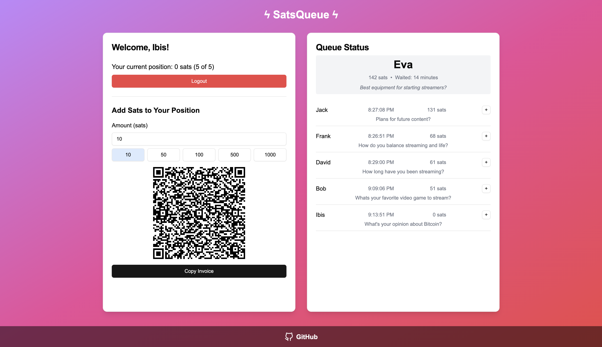
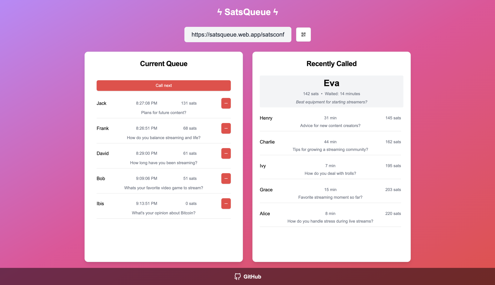

# SatsQueue

SatsQueue is a decentralized queue management system that revolutionizes the waiting experience for customers at restaurants and other venues.

[Visit Live App](https://satsqueue.web.app)

## Problem

Waiting in long queues at restaurants and other venues can be frustrating for customers, and current queue systems offer no flexibility for those who wish to move up faster. There's a need for a more dynamic approach that allows users to influence their position in the queue while maintaining fairness and transparency.

## Solution

SatsQueue introduces a decentralized queue system where users can enter a virtual queue and boost their chances of being served sooner by depositing sats via the Lightning Network. The more sats a user deposits, the higher their probability of being selected next. This creates an engaging, fair, and flexible queue experience for both customers and businesses.

### Key Features

- **Queue Joining**: Users can join a virtual queue for an establishment.
  
- **Probability Boost**: Users can deposit sats to increase their chance of being selected next.
  
- **Dynamic Sorting**: The system sorts users based on their deposits, with higher contributions leading to better odds.
- **Lightning Network Integration**: Instant transactions via the Lightning Network enable quick and seamless participation.
- **Admin Dashboard**: Venue managers can manage their queues through a dedicated admin interface.
  

## Getting Started

To run this project locally:

1. Clone the repository
2. Install dependencies with `npm install`
3. Set up your environment variables in a `.env` file
4. Run the development server with `npm run dev`

## Project Structure

src/
├── components/         # React components including UI elements
├── lib/               # Utility functions and Firebase configuration
└── pages/             # Main application pages (index and admin)

## Technologies Used

- React
- TypeScript
- Vite
- Firebase
- Lightning Network

## Contributing

Contributions are welcome! Please feel free to submit a Pull Request.

## License

This project is licensed under the MIT License.
