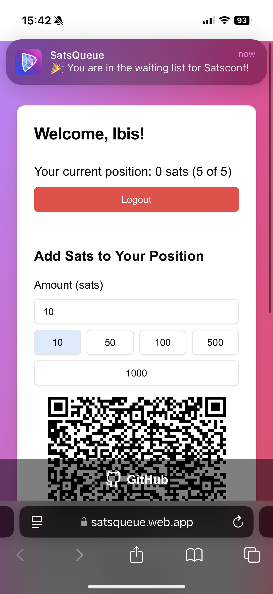

# SatsQueue

SatsQueue lets users pay to increase their chances of being served sooner in any type of queue - from restaurants to podcast live comments. Users get notified through Nostr when it's their turn.

[Visit Live App](https://satsqueue.web.app)

## Problem

Long wait times in any type of queue can be frustrating, whether it's for services, events, or online interactions. Traditional queue systems are rigid and don't offer flexibility for those who value their time differently. There's a need for a more dynamic approach that allows users to influence their position while maintaining fairness and transparency.

## Solution

SatsQueue introduces a decentralized queue system where users can enter any type of queue and boost their chances of being served sooner by depositing sats via the Lightning Network. The more sats a user deposits, the higher their probability of being selected next. This creates an engaging, fair, and flexible queue experience for both users and queue managers.

### Key Features

- **Queue Joining**: Users can join any virtual queue.
  
- **Probability Boost**: Users can deposit sats to increase their chance of being selected next, supporting both LNURL and Lightning Address payments.
- **Community Support**: Users can boost other participants' chances by topping up their sats - perfect for amplifying questions or comments you support in podcast queues.
  
- **Nostr Integration**: Link your Nostr identity (npub, nprofile, or NIP-05) to receive DM notifications for queue updates and payments.

  
- **Admin Dashboard**: Queue managers can manage their queues through a dedicated admin interface.
  

## Getting Started

To run this project locally:

1. Clone the repository
2. Install dependencies with `npm install`
3. Set up your environment variables in a `.env` file
4. Run the development server with `npm run dev`

## Technologies Used

- React
- TypeScript
- Vite
- Firebase
- Lightning Network
- Nostr

## Contributing

Contributions are welcome! Please feel free to submit a Pull Request.

## License

This project is licensed under the MIT License.
